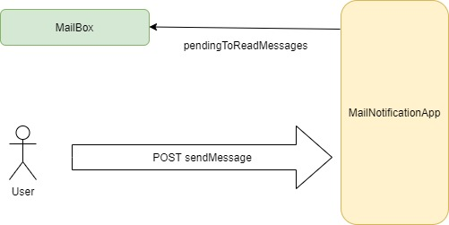

# Introducción
[](https://opensource.org/licenses/MIT)

Idioma: [English](../README.md) | Español


Esta prueba de concepto consta de dos partes:

1. En primer lugar un servicio hecho en nodo con un endpoint POST que recibe un hipotético correo electrónico y notifica al destinatario de este correo por socket que tiene mensajes sin leer.
2. Por otra parte, en la web que visualiza el cliente se actualiza el icono del correo con un tag con los correos pendientes de leer.

A continuación podemos ver en el diagrama como funciona esta app. Inicialmente el icono del cliente muestra que tiene 0 mensajes sin leer. Cuando se realiza una llamada al servicio POST se incrementa inmediatamente el número de correos sin leer.



# Starting 🚀

## Requisitos 📋
Tienes dos formas de correr la aplicación:
1. Usar tu local node.
2. Utilizar un contenedor de docker.

## Instalación 🔧
### Node
Efectúa el siguiente comando:

```bash
npm install
npm start
```

### Docker
Via Docker:

```bash
docker build -t <username>/demo-node-socker-mailbox .
```
## Test demo ⚙️

1. Abre tu navegador en la siguiente dirección:

```
http://localhost:8085
```

Establecida la conexión por socket con el servidor podrás ver los corres pendientes en zero.

2. Si realiza una petición rest de tipo `POST` podrás observar como en tiempo real se actualiza el número de mensajes de leer.

```bash
curl --location --request POST 'localhost:8085/new-message?username=anonymous'
```